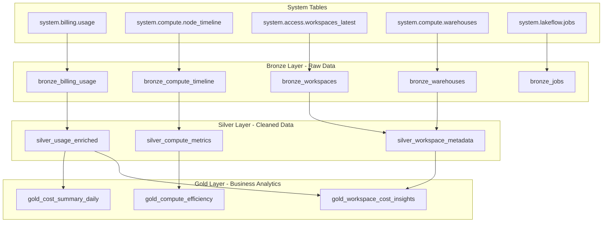
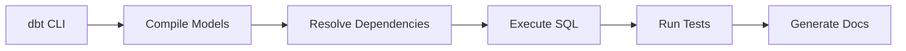
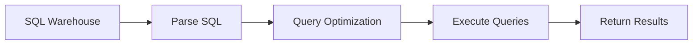

# Databricks Cost & Usage Analytics - dbt Medallion Architecture

A comprehensive dbt project implementing the medallion architecture to analyze Databricks cost and usage patterns using system tables. This project transforms raw operational data into actionable business insights for cost optimization and resource management.

## 🏗️ Project Architecture

This project follows the **medallion architecture** (Bronze, Silver, Gold) to ensure data quality, scalability, and maintainability:



## 📊 What is dbt?

**dbt (data build tool)** is a transformation tool that enables data analysts and engineers to transform data in their warehouse by simply writing select statements. dbt handles turning these select statements into tables and views.

### Core dbt Concepts:

- **Models**: SQL files that define transformations (each `.sql` file becomes a table/view)
- **Tests**: Assertions about your data to ensure quality and integrity
- **Documentation**: Automatically generated docs from your code and schema files
- **Macros**: Reusable SQL functions and logic
- **Dependencies**: Automatic execution order based on model references
- **Materializations**: How models are persisted (table, view, incremental, ephemeral)

### Why dbt?

1. **Version Control**: Treat analytics code like software development
2. **Testing**: Built-in data quality testing framework
3. **Documentation**: Auto-generated, always up-to-date documentation
4. **Modularity**: Break complex transformations into manageable, reusable pieces
5. **Lineage**: Understand data dependencies and impact analysis
6. **Environments**: Separate development, staging, and production workflows

## 🖥️ Compute Separation: dbt CLI vs SQL Warehouse

Understanding why dbt requires separate compute from the SQL warehouse is crucial:

### dbt CLI Compute (Orchestration Layer)


**Purpose**: 
- **Project orchestration**: Determines execution order, handles dependencies
- **Code compilation**: Processes Jinja templates, macros, and references
- **Testing coordination**: Executes data quality tests
- **Artifact generation**: Creates documentation, lineage, and manifests

**Resource Requirements**: 
- Lightweight compute (typically single-node)
- Python environment for dbt execution
- Access to dbt project files and profiles

### SQL Warehouse (Execution Layer)


**Purpose**:
- **SQL execution**: Runs the actual SELECT statements generated by dbt
- **Query optimization**: Leverages Photon and other Databricks optimizations
- **Data processing**: Handles large-scale data transformations
- **Concurrency**: Supports multiple simultaneous queries

**Resource Requirements**:
- Scalable compute clusters (can auto-scale based on workload)
- Optimized for analytical workloads
- Memory and CPU optimized for data processing

### Why Two Compute Layers?

1. **Separation of Concerns**: 
   - dbt CLI handles orchestration logic
   - SQL Warehouse handles data processing

2. **Resource Optimization**: 
   - Small, always-on compute for dbt orchestration
   - Scalable, on-demand compute for SQL execution

3. **Cost Efficiency**: 
   - dbt CLI runs on minimal resources
   - SQL Warehouse only scales when needed for data processing

4. **Flexibility**: 
   - Different SQL warehouses can be used for dev/prod
   - dbt CLI can coordinate across multiple warehouses

## 📁 Project Structure

```
dbt-databricks-test/
├── dbt_project.yml              # Project configuration
├── packages.yml                 # dbt packages (dependencies)
├── README.md                    # This file
├── models/
│   ├── bronze/                  # Raw data ingestion (5 models)
│   │   ├── sources.yml         # Source table definitions
│   │   ├── schema.yml          # Tests and documentation
│   │   ├── bronze_billing_usage.sql
│   │   ├── bronze_compute_timeline.sql
│   │   ├── bronze_workspaces.sql
│   │   ├── bronze_warehouses.sql
│   │   └── bronze_jobs.sql
│   ├── silver/                  # Cleaned and enriched data (3 models)
│   │   ├── schema.yml
│   │   ├── silver_usage_enriched.sql
│   │   ├── silver_compute_metrics.sql
│   │   └── silver_workspace_metadata.sql
│   └── gold/                    # Business analytics (3 models)
│       ├── schema.yml
│       ├── gold_cost_summary_daily.sql
│       ├── gold_compute_efficiency.sql
│       └── gold_workspace_cost_insights.sql
└── macros/                      # Reusable SQL functions
    ├── date_utils.sql
    └── cost_analysis.sql
```

## 🥇 Medallion Architecture Explained

### 🥉 Bronze Layer (Raw Data)
**Purpose**: Minimal transformation, data lake ingestion
- Direct ingestion from Databricks system tables
- Preserves all source data with audit timestamps
- Handles schema evolution and data quality issues
- Foundation for all downstream transformations

**Models**:
- `bronze_billing_usage`: Raw billing and usage data
- `bronze_compute_timeline`: Node-level compute metrics
- `bronze_workspaces`: Workspace configurations
- `bronze_warehouses`: SQL warehouse settings
- `bronze_jobs`: Job definitions and metadata

### 🥈 Silver Layer (Cleaned Data)
**Purpose**: Cleaned, enriched, and conformed data
- Business rules applied and data quality issues resolved
- Enriched with calculated fields and categorizations
- Joins across different data sources
- Optimized for analytical queries

**Models**:
- `silver_usage_enriched`: Billing data with workspace context
- `silver_compute_metrics`: Aggregated performance metrics
- `silver_workspace_metadata`: Enhanced workspace information

### 🥇 Gold Layer (Business Analytics)
**Purpose**: Business-ready, aggregated data for analytics and reporting
- KPIs and metrics aligned with business objectives
- Optimized for BI tools and dashboards
- Executive-ready insights and recommendations
- Historical trending and comparative analysis

**Models**:
- `gold_cost_summary_daily`: Daily cost breakdowns and trends
- `gold_compute_efficiency`: Resource utilization insights
- `gold_workspace_cost_insights`: Executive cost analysis

## 🚀 Getting Started

### Prerequisites
- Databricks workspace with Unity Catalog enabled
- Access to system tables (requires appropriate permissions)
- dbt installed with the `dbt-databricks` adapter

### 1. Clone and Setup
```bash
git clone <repository-url>
cd dbt-databricks-test
```

### 2. Install dbt packages
```bash
dbt deps
```

### 3. Configure your profile
Create or update `~/.dbt/profiles.yml`:
```yaml
databricks:
  target: dev
  outputs:
    dev:
      type: databricks
      catalog: main  # or your catalog
      schema: cost_analytics_dev
      host: <your-workspace-url>
      http_path: /sql/1.0/warehouses/<warehouse-id>
      token: <your-access-token>
    prod:
      type: databricks
      catalog: main
      schema: cost_analytics_prod
      host: <your-workspace-url>
      http_path: /sql/1.0/warehouses/<warehouse-id>
      token: <your-access-token>
```

### 4. Test your connection
```bash
dbt debug
```

### 5. Run the project
```bash
# Run all models
dbt run

# Run with tests
dbt run && dbt test

# Generate documentation
dbt docs generate
dbt docs serve
```

## 📈 Business Value

This dbt project delivers immediate business value through:

### Cost Visibility
- **Daily spending trends** by workspace and service type
- **Service category breakdown** (compute vs storage vs serverless)
- **Usage pattern analysis** (business hours vs off-hours, weekday vs weekend)

### Resource Optimization  
- **Underutilized resource identification** with specific optimization recommendations
- **Efficiency scoring** for all compute resources
- **Auto-scaling opportunity detection**

### Operational Insights
- **Workspace activity monitoring** and cost allocation
- **Growth trend analysis** with month-over-month comparisons
- **Resource rightsizing recommendations**

### Executive Reporting
- **Monthly cost insights** with business-focused recommendations
- **Workspace benchmarking** and ranking within account
- **Automated optimization suggestions** based on usage patterns

## 🧪 Data Quality & Testing

The project includes comprehensive data quality tests:

- **Not null tests** on critical business keys
- **Unique tests** on primary identifiers  
- **Range validation** for metrics (0-100% for utilization)
- **Accepted values** tests for categorical data
- **Custom business logic** validation via dbt-utils

Run tests with:
```bash
dbt test                    # Run all tests
dbt test --models bronze   # Test only bronze models  
dbt test --select tag:gold # Test only gold models
```

## 🔧 Customization

### Adding New System Tables
1. Add source definition in `models/bronze/sources.yml`
2. Create new bronze model in `models/bronze/`
3. Add to silver layer transformations as needed
4. Update gold layer analytics

### Custom Business Logic
- Modify macros in `macros/` for reusable calculations
- Update service categorization in `silver_usage_enriched.sql`
- Add custom KPIs in gold layer models

### Environment-Specific Configurations
Use dbt variables for environment-specific settings:
```bash
dbt run --vars '{"start_date": "2024-01-01", "cost_center_mapping_enabled": true}'
```

## 📚 Additional Resources

- [dbt Documentation](https://docs.getdbt.com/)
- [Databricks dbt Guide](https://docs.databricks.com/dev-tools/dbt.html)
- [Databricks System Tables Reference](https://docs.databricks.com/admin/system-tables/index.html)
- [Medallion Architecture Pattern](https://www.databricks.com/glossary/medallion-architecture)

---

**Questions or Issues?** Open an issue or consult your Databricks account team for system table access requirements.